# Pose2SimUI

[Pose2Sim](https://github.com/perfanalytics/pose2sim) 모션 캡처 파이프라인을 위한 PyQt6 기반 GUI 애플리케이션입니다.  
카메라 캘리브레이션부터 Kinematics 분석까지 전체 파이프라인을 시각적으로 관리할 수 있습니다.

---

## 시스템 요구사항

| 항목 | 요구사항 |
|---|---|
| OS | macOS (권장), Linux, Windows 10/11 |
| Python | 3.12 |
| 패키지 관리자 | [Miniconda](https://docs.conda.io/en/latest/miniconda.html) 또는 Anaconda |

---

## 설치 방법

### 1. 저장소 클론

```bash
git clone https://github.com/parkdragonstone/Pose2SimUI.git
cd Pose2SimUI
```

---

### 2. conda 환경 생성

```bash
conda create -n pose2simUI python=3.12 -y
conda activate pose2simUI
```

---

### 3. OpenSim 설치 (Kinematics 단계 필수)

OpenSim은 pip으로 설치할 수 없으며 반드시 conda 채널을 사용해야 합니다.

```bash
conda install -c opensim-org opensim -y
```

> **macOS Apple Silicon 주의사항**  
> OpenSim 4.5 이상부터 Apple Silicon을 공식 지원합니다.  
> OpenSim 없이도 앱은 실행되지만, Kinematics 단계 실행 시 오류가 발생합니다.

---

### 4. 의존성 설치

```bash
pip install -r requirements.txt
```

---

## 실행 방법

### macOS

```bash
./run.sh
```

또는

```bash
python main.py
```

### Windows

```bat
python main.py
```

> **macOS 주의사항**  
> Apple Silicon에서는 반드시 `conda run` 또는 `./run.sh`를 사용해야 합니다.  
> 직접 `python main.py` 실행 시 Bus Error가 발생할 수 있습니다.

---

## 프로젝트 폴더 구조

새 프로젝트 생성 시 아래 구조가 자동으로 만들어집니다.

```
프로젝트명/
├── calibration/
│   ├── intrinsics/       # 카메라 내부 파라미터 캘리브레이션 영상
│   └── extrinsics/       # 카메라 외부 파라미터 캘리브레이션 영상/이미지
├── Trial_01/
│   └── videos/           # 분석할 원본 영상
└── Config.toml           # 파이프라인 설정 파일
```

---

## 파이프라인 단계

| 단계 | 설명 |
|---|---|
| **Calibration** | 카메라 내부/외부 파라미터 캘리브레이션 |
| **Pose Estimation** | 각 영상에서 2D 관절 좌표 추출 |
| **Synchronization** | 다중 카메라 영상 시간 동기화 |
| **Person Association** | 다중 인물 환경에서 동일 인물 연결 |
| **Triangulation** | 2D 좌표 → 3D 좌표 변환 |
| **Filtering** | 3D 좌표 노이즈 필터링 |
| **Marker Augmentation** | 마커 보강 (LSTM 기반) |
| **Kinematics** | 관절 각도 계산 (OpenSim 필요) |

---

## 주요 기능

- **멀티 프로젝트** — 여러 프로젝트를 동시에 관리
- **실시간 설정 편집** — Config.toml을 GUI에서 직접 수정/저장
- **3D Keypoint 뷰어** — TRC 파일 기반 스켈레톤 애니메이션
- **Kinematics 뷰어** — MOT 파일 기반 관절 각도 그래프
- **GUI 파이프라인** — 각 단계를 별도 프로세스로 실행 (matplotlib GUI 지원)

---

## 문제 해결

**앱 실행 시 Bus Error (macOS)**
```bash
# .pyc 캐시 삭제 후 재실행
find . -type d -name __pycache__ -exec rm -rf {} + 2>/dev/null
./run.sh
```

**Kinematics 실행 오류**
```bash
# OpenSim 설치 확인
conda run -n pose2simUI python -c "import opensim; print(opensim.__version__)"
```

---

## 빌드 방법

소스코드로부터 독립 실행 파일(.app / .exe)을 생성합니다.  
빌드 전에 conda 환경과 의존성이 모두 설치되어 있어야 합니다.

### 사전 준비

### macOS

```bash
# 일반 빌드
./build.sh

# 이전 빌드 결과를 완전히 제거하고 새로 빌드
./build.sh --clean
```

빌드 완료 후 결과물 위치:

```
dist/Pose2SimUI.app
```

실행:

```bash
open dist/Pose2SimUI.app
```

### Windows

- 추후 업데이트
<!-- ```bat
REM 일반 빌드
build.bat

REM 이전 빌드 결과를 완전히 제거하고 새로 빌드
build.bat --clean
```

빌드 완료 후 결과물 위치:

```
dist\Pose2SimUI\Pose2SimUI.exe
``` -->

> **빌드 주의사항**  
> - 빌드 시 `__pycache__` 가 자동으로 정리됩니다.  
> - macOS에서는 `conda run` 을 통해 PyInstaller가 실행되므로 반드시 conda 환경이 활성화되어 있어야 합니다.  
> - OpenSim을 포함한 전체 기능 빌드는 OpenSim conda 환경이 구성된 상태에서만 가능합니다.

---

## Demo

### 시작 화면

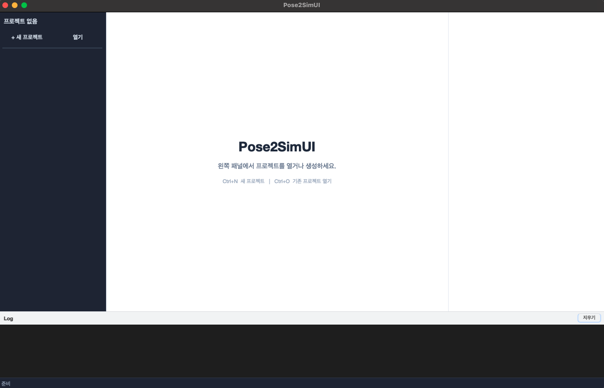

---

### 새 프로젝트 생성

왼쪽 사이드바의 **+ 새 프로젝트** 버튼 클릭 → 프로젝트 이름, 저장 위치, 카메라 수 입력 후 **OK**

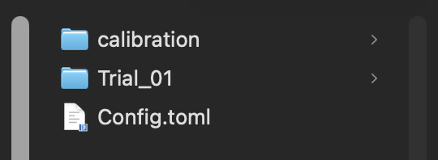

생성되는 폴더 구조:

```
프로젝트명/
├── calibration/
│   ├── intrinsics/
│   │   ├── cam01/
│   │   └── cam02/  ...
│   └── extrinsics/
│       ├── cam01/
│       └── cam02/  ...
├── Trial_01/
│   └── videos/
└── Config.toml
```

---

### Calibration

Calibration 탭에서 **+ New** 버튼 클릭

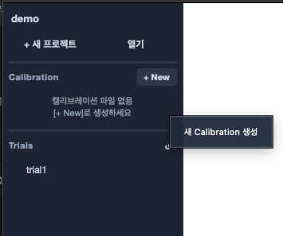

#### Intrinsic Calibration

`calibration/intrinsics/cam01/`, `cam02/` ... 폴더에 캘리브레이션 영상/이미지를 넣은 후 아래와 같이 설정합니다.

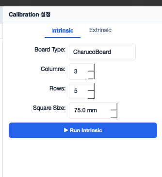

| 항목 | 값 |
|---|---|
| Board Type | CharucoBoard |
| Columns | 3 |
| Rows | 5 |
| Square Size | 75 mm |

**Run Intrinsic** 버튼 클릭 → 캘리브레이션 완료 시 `calibration/debug_images/` 에 코너 감지 이미지 저장

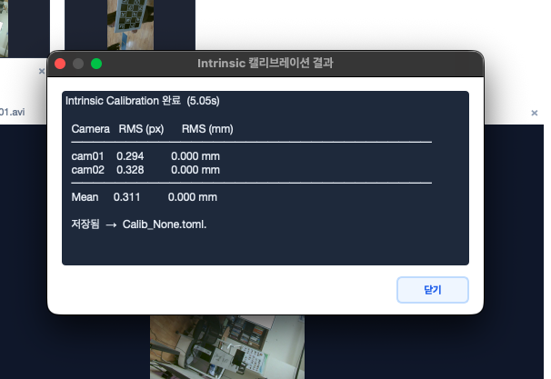

#### Extrinsic Calibration

`calibration/extrinsics/cam01/`, `cam02/` ... 폴더에 씬 영상을 넣은 후 **Scene** 을 선택합니다.

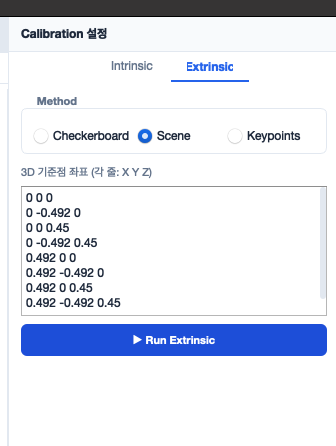

3D 기준점 좌표를 입력합니다 (단위: m):

```
0 0 0
0 -0.492 0
0 0 0.45
0 -0.492 0.45
0.492 0 0
0.492 -0.492 0
0.492 0 0.45
0.492 -0.492 0.45
```

**Run Extrinsic** 클릭 → 카메라별로 영상 프레임이 표시되면 순서대로 8개 포인트를 클릭

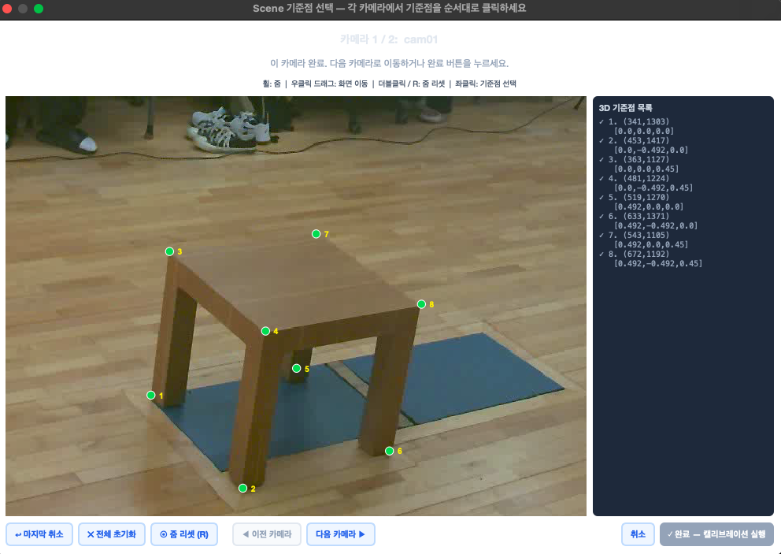
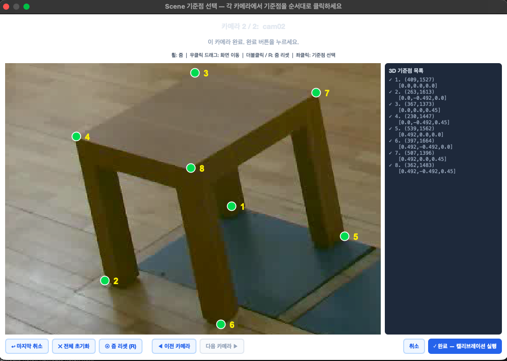

모든 카메라 포인트 입력 후 **완료 - 캘리브레이션 실행** 버튼 클릭

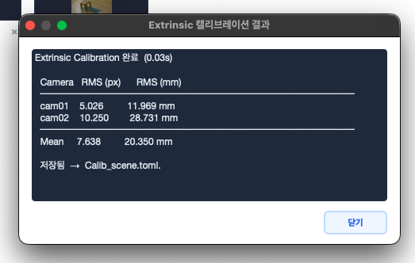

---

### 3D Analysis

왼쪽 사이드바에서 Trial 선택

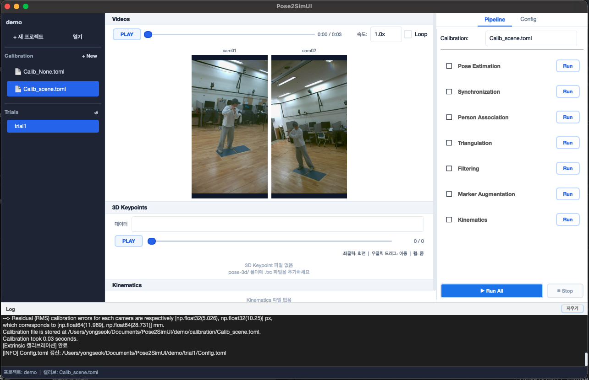

#### 설정 (Config)

오른쪽 패널에서 각 탭을 설정하고 **저장** 버튼 클릭

| 탭 | 이미지 |
|---|---|
| Project | 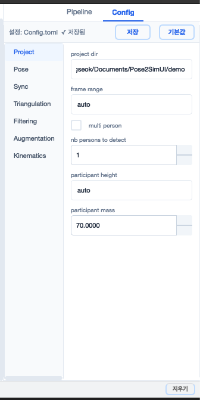 |
| Pose | 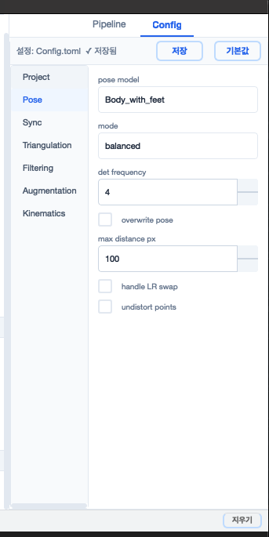 |
| Synchronization | 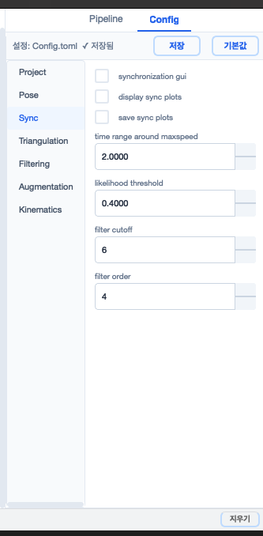 |
| Triangulation | 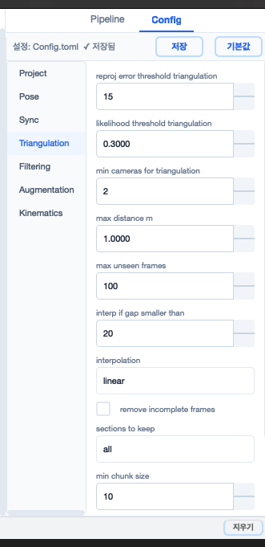 |
| Filtering | 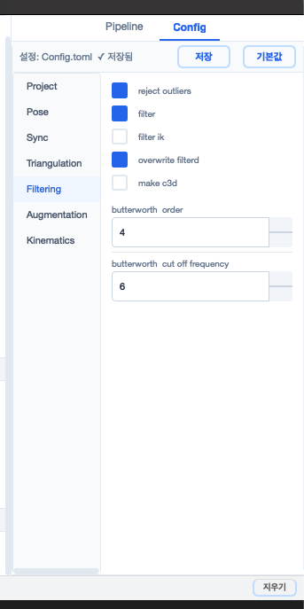 |
| Marker Augmentation | 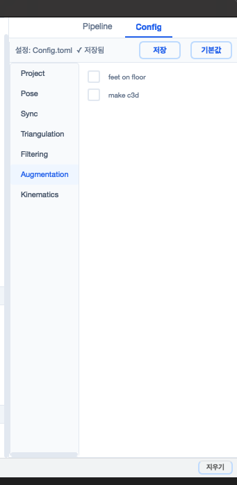 |
| Kinematics | 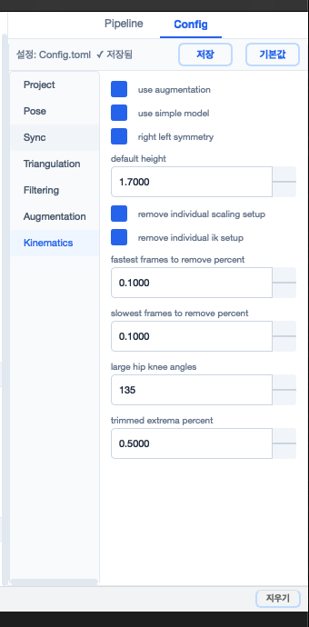 |

#### 파이프라인 실행

오른쪽 사이드바 **Pipeline** 탭에서 **Run All** 버튼 클릭

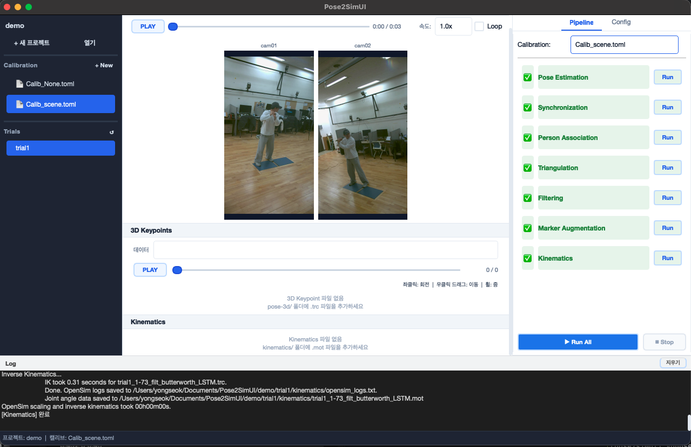

---

### 결과

#### Pose Estimation

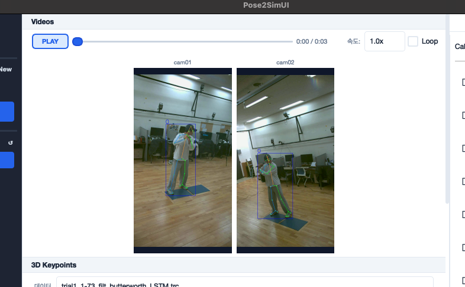

#### 3D Keypoints

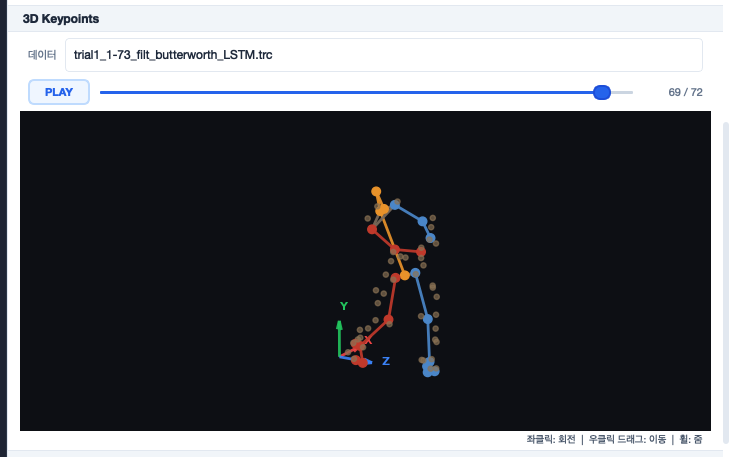

#### Kinematics Graph

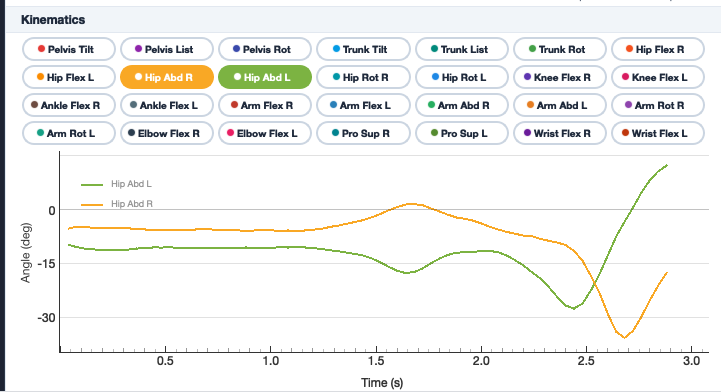

#### 결과 폴더 구조

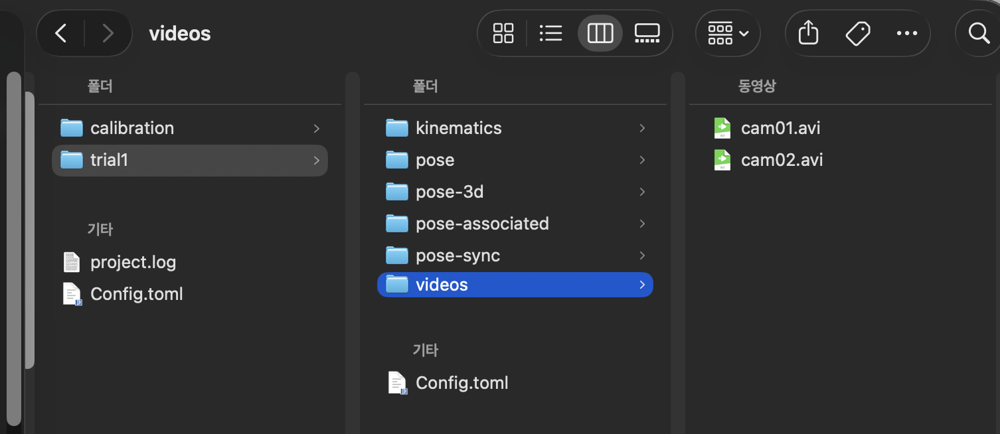